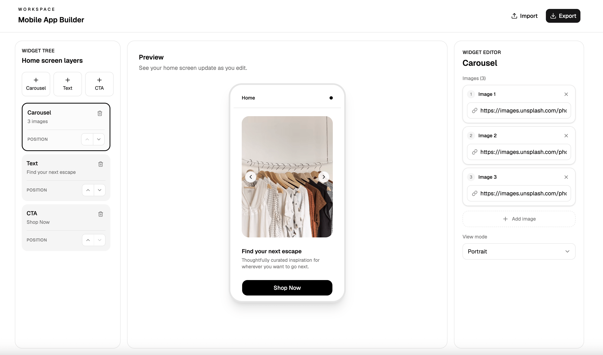

# Mobile App Home Screen Editor

A responsive React application for building and previewing a mobile app home screen in real time. Users can add, edit, remove, and reorder carousel, text, and call-to-action sections, then export or restore the configuration as JSON.

[View the live demo](https://reactivchallenge.netlify.app/)



## Run locally

Use Node.js 20.19+ or 22.12+ and npm.

```bash
git clone https://github.com/David-McCaig/take-home-challenge-front-end-build-a-mobile-app-home-editor.git
cd take-home-challenge-front-end-build-a-mobile-app-home-editor
npm install
npm run dev
```

Open the local URL printed by Vite.

## Available commands

```bash
npm run dev      # start the development server
npm test         # run the test suite once
npm run lint     # run ESLint
npm run build    # type-check and create a production build
npm run preview  # serve the production build locally
```

## Features

- Live mobile preview for every valid edit.
- Multiple carousel, textarea, and CTA sections.
- Accessible add, delete, and up/down reorder controls.
- Carousel image URL management and portrait, landscape, or square layouts.
- Editable textarea content and independent title/description colors.
- Editable CTA label, HTTP(S) link, button color, and text color.
- Versioned JSON import/export with runtime validation and graceful error feedback.
- Responsive editor layout, keyboard focus states, empty states, and broken-image handling.

## Architecture and considerations

The data model has two layers. First is `AppConfig`, the serializable document. It's just a version number and an ordered list of sections. That's the thing you export as JSON and import back.

Second is `EditorState`, the config plus `selectedSectionId`. It's transient UI state, kept separate from the document itself. When you export, the selection doesn't come along. Nothing about it belongs in the config that ships.

Sections are a discriminated union consisting of `CarouselSection`, `TextareaSection`, and `CTASection`. Each has a type literal tag and an ID. Rendering is just a switch on type.

I also think of these as two product surfaces. The editor is where you compose. The phone preview simulates what a native app would render: the real customer-facing surface. `PhonePreview` receives `AppConfig` as a plain prop, with no Context. It renders imported config, default config, or any other config the same way. That separation is the whole reason the preview can stand in for a renderer I don't control.

There's also a deliberate split between TypeScript types, which describe what my own code expects, and Zod schemas, which validate what comes from the outside world. Import goes through `safeParse`, and on failure the current config is preserved.

Tests focus on user-visible behaviour and the boundaries most likely to fail: adding, removing, and reordering sections; propagating edits into the preview; validating inputs; reducer behaviour; and accepting or rejecting imported configurations.

## AI usage

I used OpenAI Codex as a pair-programming tool for implementation suggestions, test cases, refactoring, and documentation. `AGENTS.md` provided the repository-level workflow and architecture rules, and directed Codex to the build plan and more specific React and testing guidance in `docs/` when relevant. This kept its suggestions aligned with the project rather than letting the tool make architectural decisions independently. I reviewed the generated code and accepted, revised, or rejected suggestions based on correctness, accessibility, scope, and maintainability.

One example was the generated section-label helper:

```ts
function sectionLabel(section: Section) {
  if (section.type === "carousel") return ["Carousel", `${section.images.length} images`]
  if (section.type === "textarea") return ["Text", section.title || "Untitled"]
  return ["CTA", section.label || "Unlabelled"]
}
```

This worked with the three existing section types, but the final return assumed anything else must be a CTA. That could hide a bug if another section type was added later. I replaced it with an exhaustive switch, so adding a new section type without handling it here will cause a TypeScript error:

```ts
function sectionLabel(section: Section) {
  switch (section.type) {
    case "carousel":
      return ["Carousel", `${section.images.length} images`]
    case "textarea":
      return ["Text", section.title || "Untitled"]
    case "cta":
      return ["CTA", section.label || "Unlabelled"]
    default:
      return section satisfies never
  }
}
```

## Technology

React 19, TypeScript, Vite, Tailwind CSS, shadcn/ui, Embla Carousel, Zod, Vitest, and React Testing Library.
